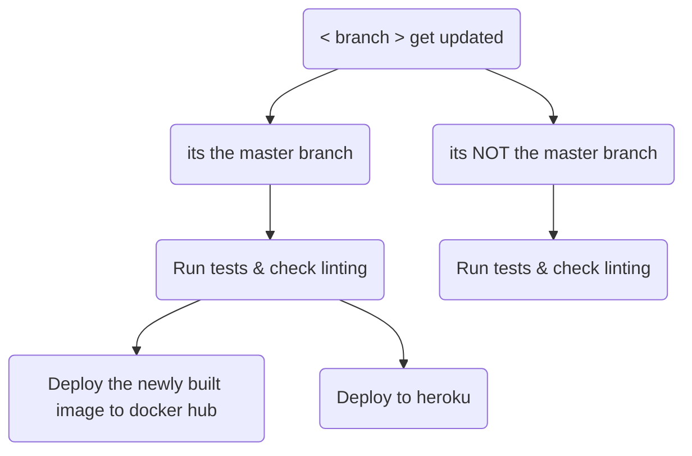

<p align="center">
    
</p>


## Circle Ci 
[](https://circleci.com/gh/Madscientiste/OpenClassrooms_P13/tree/master)

## Heroku
<!-- https://heroku.com/deploy?template=https://github.com/Madscientiste/OpenClassrooms_P13/tree/main -->

[](https://heroku.com/deploy?template=https://github.com/Madscientiste/OpenClassrooms_P13/tree/master&env[SENTRY_DSN]=replace_me)

## Local Development

### Requirements
- [Python 3.9+](https://www.python.org/downloads/) 
- [GIT](https://git-scm.com/downloads)

### Setup

Clone this repository to your local machine & cd into it.

```bash
git clone <repo_url> <destination>
cd <destination>
```

Create a virtual environment and activate it.

```bash
python -m venv .venv

[windows]
./.venv/Scripts/activate

[UNIX]
source .venv/bin/activate
```

Install required dependencies.

```bash
pip install -r requirements.txt
```

when everything has installed correctly, ensure to sync the database schema with the migrations.

> ### if this is the first run from the previous version, fake the inital migrations.

```bash
python manage.py migrate lettings 0001 --fake
python manage.py migrate profiles 0001 --fake
```

Then, migrate 
```bash
python manage.py migrate
``` 

Check everything works correctly

```bash
python -m pytest
```

5 tests should pass.

### Running the Project

```bash
python manage.py runserver
```

#### Check the linting of the project

```bash
python -m flake8
``` 


#### Admin panele can be accessed at http://localhost:8000/admin/
- You can authenticate with `admin` as the username, and `Abc1234!` as the password.

## Deployment

### Requirements
- [Circle CI Account](https://circleci.com)
- [Heroku Account](https://heroku.com)
- [Docker Account](https://www.docker.com)

#### How it Works



### Setup CircleCI

Fews environment variables are required to be set inside the CircleCI project.

```bash
DOCKER_IMG = "<docker_username>/<docker_repository>"
# eg: DOCKER_IMG = "shaade/ocr-p13"

DOCKER_PASS = "<docker_password>"
# eg: DOCKER_PASS = your password or access token

DOCKER_USERNAME = "<docker_username>"
# eg: DOCKER_USERNAME = your username
```

### Setup Sentry

Create a new project in Sentry. And save the DSN in the .env variable as `SENTRY_DSN`.

### Setup Heroku

Only Sentry's DSN is required for heroku.

```bash	
SENTRY_DSN = "<sentry_dsn>"
# eg: SENTRY_DSN = "https://kqzhrglierzhqglerqughlihuget.ingest.sentry.io/5843684"
```
